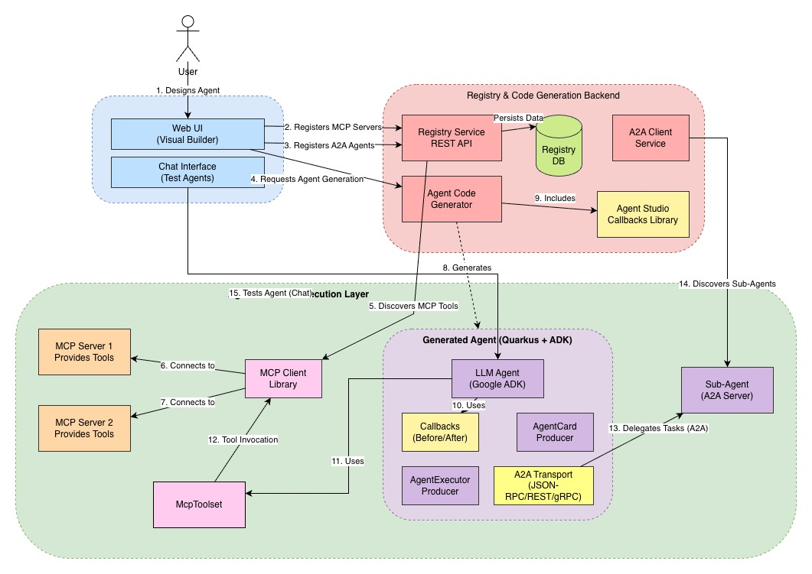
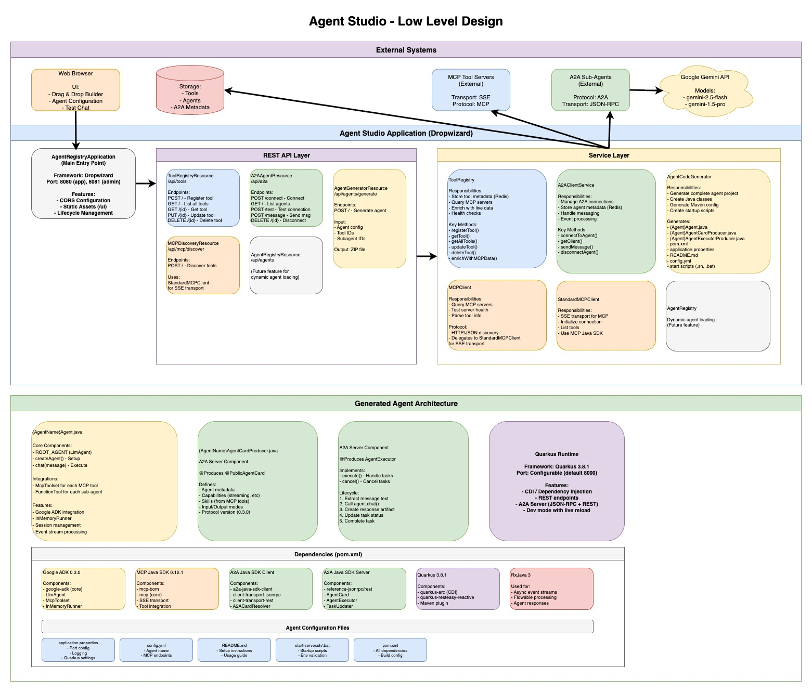

# Agent Studio

**A Production-Ready AI Agent Code Generator**

Agent Studio is an enterprise-grade platform for generating AI agents with Model Context Protocol (MCP) tool integration and Agent-to-Agent (A2A) communication capabilities, powered by Google ADK and Quarkus.

## Overview

Agent Studio accelerates AI agent development by providing:

- **MCP Tool Server Management** - Register and integrate external tools and services via Model Context Protocol
- **A2A Agent Registry** - Build hierarchical multi-agent architectures with specialized sub-agents
- **Visual Composition Interface** - Drag-and-drop builder for composing agents with tools and sub-agents
- **Code Generation Engine** - Generate complete, production-ready Maven projects with all dependencies
- **Interactive Testing** - Test and validate agents in real-time through an integrated chat interface

## Objective

Agent Studio simplifies the development lifecycle of intelligent agents by automating infrastructure setup, dependency management, and protocol integration. It enables developers to focus on agent behavior and business logic rather than boilerplate code and configuration.

### Key Benefits

- **Reduce Development Time**: From weeks to minutes with automated code generation
- **Production-Ready Output**: Complete projects with proper dependency injection, configuration management, and deployment scripts
- **Protocol-Agnostic**: Support for multiple transport protocols (REST, JSON-RPC, gRPC)
- **Extensible Architecture**: Modular design allows easy customization and extension

## Architecture

### High-Level Design (HLD)

Agent Studio follows a three-tier architecture with clear separation between presentation, application logic, and integration layers:



The system comprises:
- **Web Interface**: Visual agent builder with drag-and-drop composition
- **Registry Services**: Tool Registry and Agent Registry with Redis persistence
- **Code Generator**: Template-based Maven project generation
- **Integration Layer**: MCP and A2A protocol clients

### Low-Level Design (LLD)

Detailed component interactions and data flow:



Core components include:
- **ToolRegistry**: Manages MCP tool server registrations and health checks
- **AgentRegistry**: Central registry for agent metadata with pub/sub notifications
- **AgentCodeGenerator**: Generates complete Maven projects with dependency injection
- **CallbackRegistry**: Extensible hooks for agent lifecycle management

### Generated Agent Stack

Each generated agent is a complete Quarkus application that includes:

- **Google ADK (Agent Development Kit)** - LLM agent orchestration framework
- **MCP Java SDK** - Model Context Protocol client for tool integration
- **A2A Java SDK** - Agent-to-Agent communication protocol
- **Quarkus** - Cloud-native Java framework with CDI and reactive capabilities

### Key Features

#### MCP Tool Integration
- Connect to any MCP-compliant tool server
- Dynamic tool discovery and capability querying
- SSE (Server-Sent Events) transport protocol support
- Runtime tool invocation with automatic schema validation

#### A2A Sub-Agent Delegation
- Hierarchical agent architectures with supervisor-worker patterns
- AgentCard-based capability discovery
- Multi-protocol transport support (REST, JSON-RPC, gRPC)
- Task delegation with automatic serialization/deserialization

#### Enterprise-Grade Configuration
- Environment-based credential management
- Customizable server ports and endpoints
- Health checks and monitoring endpoints
- Production-ready startup scripts for Unix and Windows

## Getting Started

### Prerequisites

- **Java Development Kit (JDK)** - Version 17 or higher
- **Apache Maven** - Version 3.6 or higher
- **Redis Server** - Version 6.0 or higher (for registry persistence)
- **Google AI API Key** - Obtain from [Google AI Studio](https://aistudio.google.com/app/apikey)

### Running Agent Studio

1. **Clone the repository:**
   ```bash
   git clone <repository-url>
   cd agent-studio
   ```

2. **Start Redis server:**
   ```bash
   redis-server
   ```

3. **Build the project:**
   ```bash
   mvn clean package
   ```

4. **Run the application:**
   ```bash
   mvn quarkus:dev
   ```

5. **Access the web interface:**
   ```
   http://localhost:8080
   ```

## Usage Guide

### Step 1: Register MCP Tools

Register external tool servers via the web interface:

1. Click "Register MCP Tool" button
2. Provide the following information:
   - **Tool Name**: Unique identifier (e.g., `weather-tool`)
   - **Description**: Tool functionality description
   - **MCP Server Endpoint**: URL of the running MCP server (e.g., `http://localhost:3000`)
3. System validates connectivity and queries available capabilities
4. Tool appears in the registry with metadata and function signatures

### Step 2: Register A2A Agents

Register sub-agents for hierarchical architectures:

1. Click "Register A2A Agent" button
2. Enter the AgentCard URL (e.g., `http://localhost:8001/agent-card`)
3. Click "Test Connection" to verify agent accessibility
4. Review agent capabilities, supported protocols, and task schemas
5. Confirm registration to add agent to the sub-agent registry

### Step 3: Compose Your Agent

Build agents using the visual composition interface:

1. Navigate between "Attached Tools" and "Sub-Agents" tabs
2. Drag and drop resources from the left sidebar to the canvas
3. Configure agent properties in the right panel:
   - **Agent Name**: Unique agent identifier
   - **Description**: Agent purpose and capabilities
   - **System Instructions**: Behavior guidelines and constraints
   - **Package Name**: Java package namespace (e.g., `com.example.agent`)
   - **Google API Key**: Gemini API credentials
   - **Server Port**: HTTP server port (default: 8000)

### Step 4: Generate Agent Code

Generate and download the complete agent project:

1. Click "Generate & Download Agent" button
2. System generates a ZIP archive containing:

```
your-agent/
├── pom.xml                          # Maven project file
├── README.md                        # Agent-specific documentation
├── config.yml                       # Tool configurations
├── start-server.sh                  # Startup script (Unix)
├── start-server.bat                 # Startup script (Windows)
└── src/
    └── main/
        ├── java/
        │   └── com/example/agent/
        │       ├── YourAgent.java              # Main agent class
        │       ├── YourAgentCardProducer.java  # A2A AgentCard
        │       └── YourAgentExecutorProducer.java # A2A Executor
        └── resources/
            └── application.properties          # Quarkus config
```

### Step 5: Deploy Your Generated Agent

1. **Extract the ZIP archive**
   ```bash
   unzip your-agent.zip
   cd your-agent
   ```

2. **Configure environment variables:**
   ```bash
   export GOOGLE_API_KEY=your-api-key-here
   ```

3. **Start the agent server:**
   ```bash
   ./start-server.sh
   # or use Maven directly
   mvn quarkus:dev
   ```

4. **Verify deployment:**
   - AgentCard endpoint: `http://localhost:{port}/agent-card`
   - A2A task endpoint: `http://localhost:{port}/tasks`
   - Health check: `http://localhost:{port}/q/health`

## Example Use Cases

### Use Case 1: Intelligent Travel Planner

**Scenario**: Travel agent with real-time weather integration

**Configuration**:
- Attach MCP tool: `weather-tool` (provides current weather and forecasts)
- System instructions: "Plan trips considering weather conditions, user preferences, and seasonal factors"
- LLM: Google Gemini for natural language understanding and itinerary generation

**Capabilities**:
- Query weather conditions for destination cities
- Recommend travel dates based on weather patterns
- Adjust itineraries dynamically based on forecasts

### Use Case 2: Multi-Agent Research System

**Scenario**: Hierarchical agent system for complex research tasks

**Architecture**:
- **Supervisor Agent** (coordinator)
  - **Research Agent** (sub-agent): Web search and data gathering
  - **Analysis Agent** (sub-agent): Statistical analysis and pattern recognition
  - **Writing Agent** (sub-agent): Document synthesis and report generation

**Workflow**:
1. User submits research query to supervisor
2. Supervisor delegates search tasks to Research Agent
3. Collected data sent to Analysis Agent for processing
4. Analysis results forwarded to Writing Agent
5. Supervisor synthesizes final report from sub-agent outputs

**Benefits**: Task specialization, parallel processing, modular scalability

## Project Structure

```
agent-studio/
├── src/main/java/com/example/agent/
│   └── registry/
│       ├── AgentCodeGenerator.java       # Generates agent code
│       ├── AgentGeneratorResource.java   # REST API for generation
│       ├── ToolRegistry.java             # Manages MCP tools
│       ├── A2AClientService.java         # A2A agent registry
│       └── MCPClient.java                # MCP server connector
└── src/main/resources/
    └── static/
        └── unified-builder.html          # Web UI
```

## Technologies Used

- **[Google ADK](https://github.com/google/adk)** - Agent orchestration framework
- **[MCP Java SDK](https://github.com/modelcontextprotocol/java-sdk)** - Model Context Protocol implementation
- **[A2A Java SDK](https://github.com/a2asdk/a2a-java-sdk)** - Agent-to-Agent protocol implementation
- **[Quarkus](https://quarkus.io/)** - Cloud-native Java framework
- **[Gemini](https://ai.google.dev/)** - Google's generative AI model

## Architecture Patterns

### MCP Tool Integration Pattern

```
┌─────────┐        ┌────────────┐        ┌────────────┐        ┌──────────────┐
│  Agent  │───────►│ McpToolset │───────►│ MCP Server │───────►│ External Tool│
└─────────┘        └────────────┘        └────────────┘        └──────────────┘
     │                                           │
     └──────────────Tool Response────────────────┘
```

**Flow**:
1. Agent receives user request requiring external tool
2. LLM generates tool invocation with parameters
3. McpToolset routes request to appropriate MCP server
4. MCP server executes tool and returns result
5. Agent processes response and continues conversation

**Key Features**: Dynamic tool discovery, schema validation, SSE transport

### A2A Agent Delegation Pattern

```
┌──────────────────┐        ┌────────────┐        ┌───────────┐
│ Supervisor Agent │───────►│ A2A Client │───────►│ Sub-Agent │
└──────────────────┘        └────────────┘        └───────────┘
         │                                               │
         └──────────────Response Aggregation─────────────┘
```

**Flow**:
1. Supervisor analyzes task and identifies required capabilities
2. A2A client constructs task payload with instructions and context
3. Client selects transport protocol (REST/JSON-RPC/gRPC)
4. Sub-agent processes task using specialized tools and LLM
5. Response returned to supervisor for synthesis
6. Supervisor aggregates outputs and generates final response

**Key Features**: Protocol negotiation, capability-based routing, hierarchical composition

## Configuration

### Agent Studio Configuration

**Environment Variables**:
- `REDIS_HOST` - Redis server hostname (default: localhost)
- `REDIS_PORT` - Redis server port (default: 6379)
- `QUARKUS_HTTP_PORT` - Web interface port (default: 8080)

**Application Properties** (`src/main/resources/application.properties`):
```properties
quarkus.redis.hosts=redis://localhost:6379
quarkus.http.port=8080
quarkus.http.cors=true
```

### Generated Agent Configuration

**Environment Variables**:
- `GOOGLE_API_KEY` - Required for Gemini model access
- `QUARKUS_HTTP_PORT` - Agent server port (default: 8000)

**Configuration Files**:
- `application.properties` - Quarkus runtime configuration
- `config.yml` - MCP tool server endpoints

**Example config.yml**:
```yaml
mcp:
  tools:
    - name: weather-tool
      endpoint: http://localhost:3000
    - name: database-tool
      endpoint: http://localhost:3001
```

## Troubleshooting

### Common Issues

#### Agent Fails to Start

**Symptoms**: Application crashes on startup or fails to bind to port

**Solutions**:
- Verify Java 17+ is installed: `java -version`
- Ensure port is not already in use: `lsof -i :8000`
- Check Redis connectivity: `redis-cli ping`
- Review application logs for stack traces

#### Agent Doesn't Respond to Queries

**Symptoms**: Agent endpoints return errors or timeout

**Solutions**:
- Verify `GOOGLE_API_KEY` environment variable is set
- Check Gemini API quota and rate limits
- Confirm MCP tool servers are running and accessible
- Review agent logs for LLM errors or tool invocation failures

#### Sub-Agent Communication Timeout

**Symptoms**: Supervisor agent fails to reach sub-agents

**Solutions**:
- Verify sub-agent is running: `curl http://localhost:8001/agent-card`
- Check network connectivity and firewall rules
- Validate AgentCard URL configuration
- Increase timeout values in A2A client configuration

#### Tool Discovery Failures

**Symptoms**: MCP tools not appearing in registry or returning errors

**Solutions**:
- Verify MCP server endpoint URL is correct and accessible
- Test MCP server manually: `curl http://localhost:3000/sse`
- Check MCP server logs for errors
- Ensure MCP server implements correct protocol version
- Verify network policies allow SSE connections

#### Redis Connection Errors

**Symptoms**: Registry operations fail or timeout

**Solutions**:
- Verify Redis is running: `redis-cli ping`
- Check Redis configuration in `application.properties`
- Review Redis logs for connection errors
- Ensure Redis version is 6.0 or higher

## Development

### Project Structure

```
agent-studio/
├── src/main/java/com/example/agent/
│   └── registry/
│       ├── AgentCodeGenerator.java          # Maven project generator
│       ├── AgentGeneratorResource.java      # Code generation REST API
│       ├── ToolRegistry.java                # MCP tool registry service
│       ├── AgentRegistry.java               # A2A agent registry service
│       ├── A2AClientService.java            # A2A protocol client
│       ├── MCPClient.java                   # MCP protocol client
│       └── CallbackRegistry.java            # Callback hook registry
├── src/main/resources/
│   ├── static/
│   │   ├── unified-builder.html             # Visual agent builder UI
│   │   ├── docs-content.js                  # Technical documentation
│   │   └── img/
│   │       ├── agent-registry-hld.jpg       # High-level architecture
│   │       └── agent-registry-lld.jpg       # Low-level design
│   └── application.properties                # Quarkus configuration
└── pom.xml                                   # Maven dependencies
```

### Building from Source

```bash
mvn clean package -DskipTests
mvn quarkus:dev
```

### Running Tests

```bash
mvn test
```

## Contributing

Contributions are welcome! Please follow these guidelines:

1. **Code Style**: Follow existing code patterns and formatting
2. **Testing**: Add unit tests for new functionality
3. **Documentation**: Update README and inline documentation
4. **Commits**: Use descriptive commit messages with conventional commit format
5. **Pull Requests**: Provide clear description of changes and motivation

## License

This project is licensed under the [Apache License 2.0](LICENSE)

## Support and Contact

- **Issues**: Report bugs and feature requests via [GitHub Issues](https://github.com/your-org/agent-studio/issues)
- **Documentation**: See [Technical Documentation](http://localhost:8080/docs) for detailed architecture
- **Community**: Join discussions in [GitHub Discussions](https://github.com/your-org/agent-studio/discussions)
